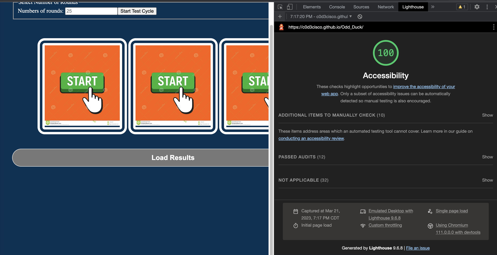
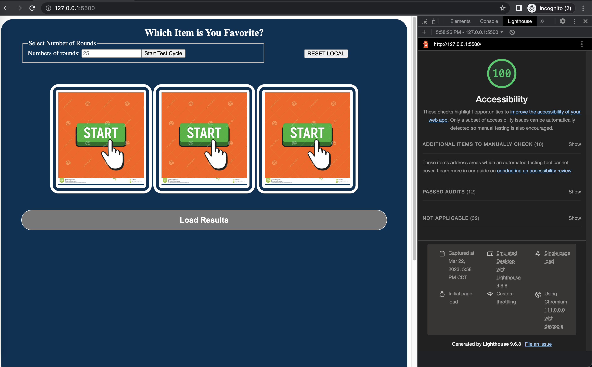

# Odd_Duck

Project helping Odd Duck Product Co run analysis on favorite products from a desired group size. From each test group, the data is stored and added to previously stored values. Additionally, the team from Odd Duck Product Co can clear all data with a simple click of the button.

## Summary

The app flips through a variety of preselected pictures. No round will have a duplicate image and no consequent rounds will have similar images. The app starts with a click me picture and finishes the round with a thank you image.

### Author: Francisco Sanchez

### Links and Resources

### Lighthouse Accessibility Report Score

### Reflections and Comments
